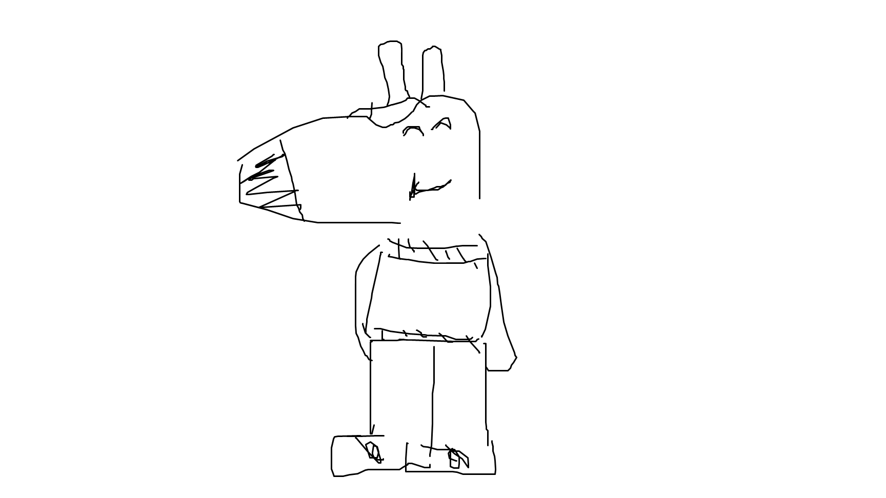

# 🧠 MemoryMate

A **smart wearable device** leveraging **AI** and **facial recognition** to help individuals with **memory-related disabilities** remember and identify people they interact with.

## 👥 Authors

- [Gurtej Grewal](https://github.com/GrewalCreator)
- [Krins Vaghasia](https://github.com/KrinsKumar)
- [Vansh Shah](https://github.com/vansh2006)
- [Aryan Khurana](https://github.com/AryanK1511)
